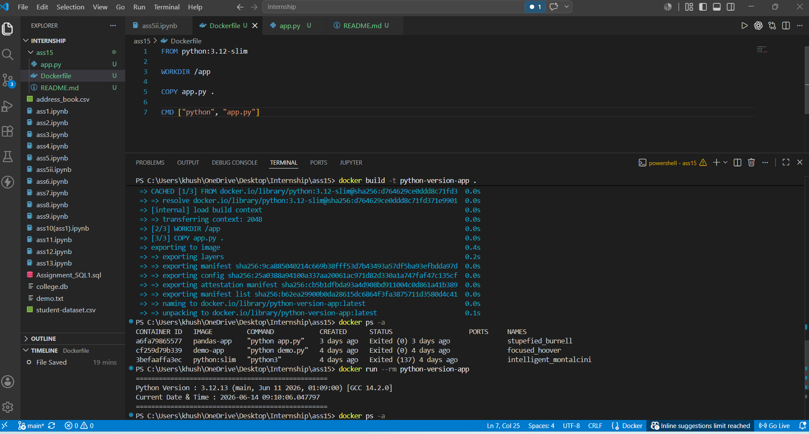

# Dockerized Python Application

This project demonstrates a simple Dockerized Python application using the official Python 3.12 Slim image.

## Features

- Uses python:3.12-slim as base image
- Displays Python version running inside the container
- Displays current date and time
- Automatically executes when the container starts

## Build Docker Image

Run the following command in the project directory:
```bash
docker build -t python-version-app .
```

## Run Docker Container

```bash
docker run --rm python-version-app
```
## Sample Output

```text
==================================================
Python Version : 3.12.x (main, ...)
Current Date & Time : 2026-06-14 12:45:30.123456
==================================================
```

## Screenshot

Add a screenshot named:

```
screenshot.png
```

Example:



